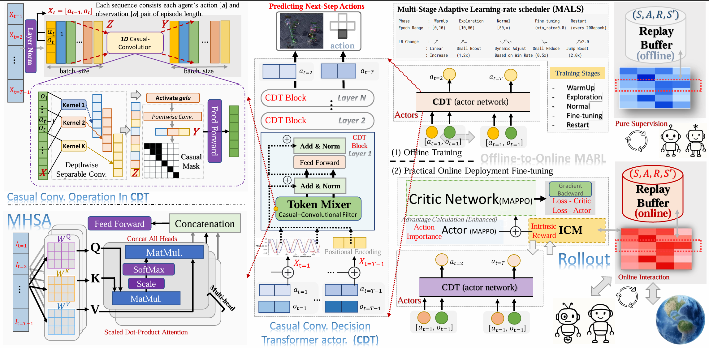
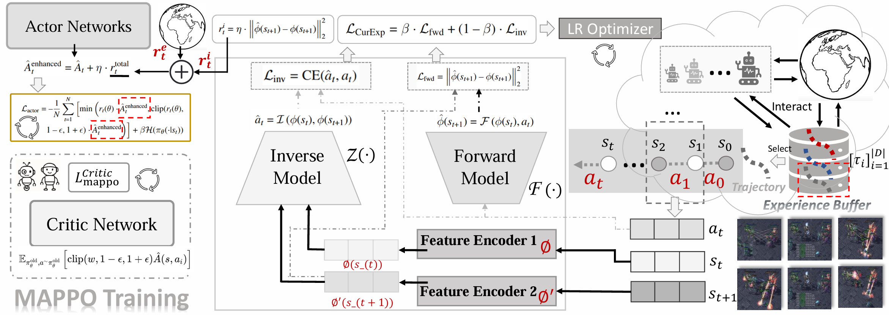
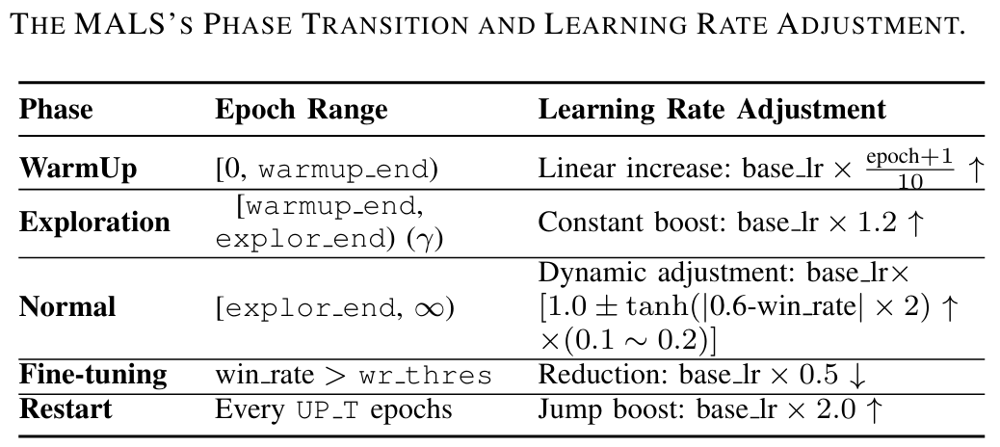
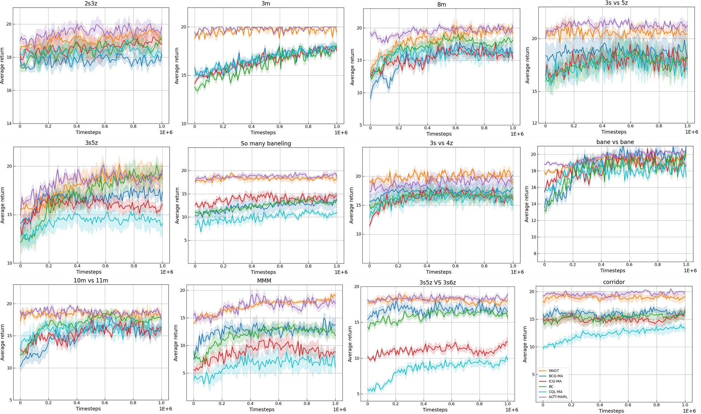
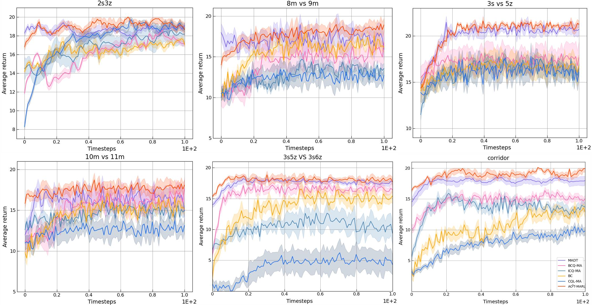
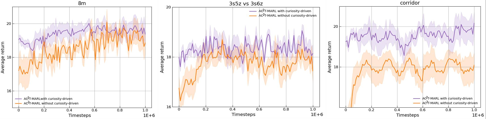
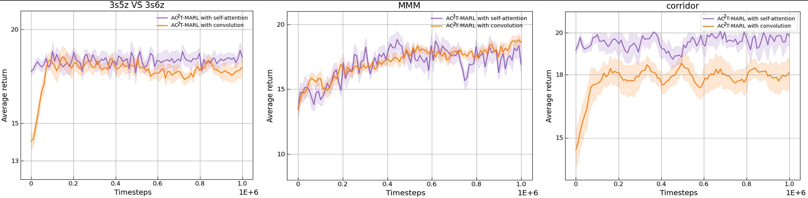

# AC2T-MARL: An Adaptive Intrinsic Curiosity-Driven Causal Convolutional Transformer for Online-Finetuned Multi-Agent Reinforcement Learning (StarCraft II) ⭐⭐⭐⭐⭐

[](https://opensource.org/licenses/MIT)
[](https://www.python.org/downloads/)
[](https://pytorch.org/)

Official implementation of our anonymous conference submission:  
**"AC2T-MARL: An Adaptive Intrinsic Curiosity-Driven Causal Convolutional Transformer for Online-Finetuned MARL"**

[[Paper Not OpenAccess]](https://SmileHappyEveryDay/AnonymousIntro) | [[Project Page]](https://github.com/SmileHappyEveryDay/AC2T-MARL) | [[SMAC Benchmark]](https://github.com/oxwhirl/smac)

<!-- https://arxiv.org/abs/XXXX.XXXXX -->
---

## 🚀 Key Features
- **CDT**: Multi-Agent Causal Decision Transformer integrating causal convolution filters into Transformer architecture
- **ICM**: Novel Intrinsic Curiosity Module using next-state prediction error
- **MALS**: Multi-stage Adaptive Learning-rate Scheduler for robust optimization
---
- **State-of-the-art performance** on StarCraft II Micromanagement (SMAC) benchmark
- **Enhanced OOD Generalization**: Superior handling of out-of-distribution (OOD) states through improved exploration

---
- Main Architecture of AC2T-MARL & CDT Actor
<p align="center">
  
</p>

---
- Structure of ICM, Intrinsic Curiosity Module
<p align="center">
  
</p>

---
- Details of Multi-Stage Adaptive Learning-rate scheduler (MALS)
<p align="left">
  
</p>

---
## 🧩 Key Components
- **CDT Architecture**: 
  - Replaces MHSA in Transformer with causal-convolution based token-mixer
  - Better captures localized temporal patterns in MDP sequences
  - Enhanced generalization for OOD states through improved Markov property modeling
- **ICM Mechanism**: 
  - Utilizes forward dynamics model for next-state transition prediction
  - Uses prediction error to guide exploration towards uncertain states
  - Bridges offline-online distribution gap during fine-tuning
- **MALS Scheduler**: 
  - Multi-stage adaptive learning rate adjustment
  - Warmup phase for stability, exploration phase for adaptation, fine-tuning phase for convergence
  - Dynamic optimization based on real-time performance feedback

---
## 📌 Installation

1. **Clone the repository**:
```bash
git clone https://github.com/SmileHappyEveryDay/AC2T-MARL.git
cd AC2T-MARL
```

2. **Install dependencies**:
```bash
pip install -r requirements.txt
bash install_sc2.sh
```

## 🏃 Quick Start

Run offline pre-training + online fine-tuning (offline-to-online) on 3s5z map:
```bash
python run_ac2tmarl_sc2.py --map_name 3s5z --cuda_id 0
```

## 🏆 Performance

- Performance Comparisons of Online Fine-tuning
---
<p align="center">
  
</p>

- Offline Comparisons Between Baselines and Our AC2T-MARL
---
<p align="center">
  
</p>

## 🏆🏆 Ablations

- Ablation of ICM comparison in AC2T-MARL ➡️ (Curiosity-Driven Exploration vs. Without Curiosity-Driven Exploration)
---
<p align="center">
  
</p>

- Ablation of CDT in AC2T-MARL ➡️ (Causal-Convolution vs. Transformer MHSA)
---
<p align="center">
  
</p>

## 🛠️ Customization
Modify `./models/gpt_model.py` to:
- <span style="color:red">Adjust causal-convolution architectures </span>
- <span style="color:red">Experiment with different token mixing strategies </span>
- <span style="color:red">Tune convolution filter parameters</span>

Modify `./models/curiosity_model.py` to:
- <span style="color:green">Implement custom curiosity mechanisms </span>
- <span style="color:green">Modify prediction error calculation </span>
- <span style="color:green">Adjust exploration bonus weights</span>

Edit `./framework/utils.py` & `./framework/trainer.py` & `./framework/rollout.py` to:
- <span style="color:purple">Customize learning rate schedules </span>
- <span style="color:purple">Modify phase transition thresholds </span>
- <span style="color:purple">Implement alternative adaptive strategies</span>

---

## 🤝 Contributing
We welcome contributions! Please open an issue or submit PRs for:
-  <span style="color:red">Alternative Transformer actor and curiosity-driven exploration mechanisms</span>
- <span style="color:red">Other innovative performance optimization more than our LR scheduler.</span>

This project is forked from [ReinholdM/Offline-Pre-trained-Multi-Agent-Decision-Transformer](https://github.com/ReinholdM/Offline-Pre-trained-Multi-Agent-Decision-Transformer), many thanks to their foundational research work.

## 📜 Citation
If you use this work, please cite:
```bibtex
@article{anonymous2025AC2TMARL,
  title={AC2T-MARL: An Adaptive Intrinsic Curiosity-Driven Causal Convolutional Transformer for Online-Finetuned Multi-Agent Reinforcement Learning},
  author={anonymous authors},
  conference={anonymous conference (under review)},
  year={2025},
}
